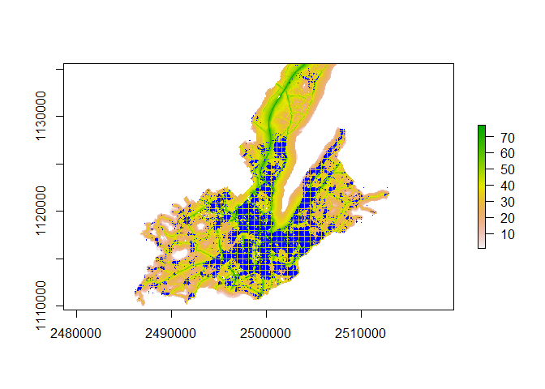
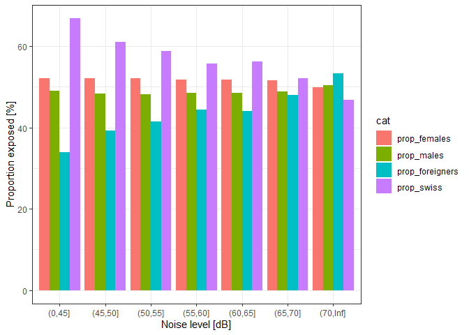

Geneva road traffic noise
================
2024-02-07

## Population exposed to road noise in Geneva

In a few lines of code we will manipulate different datasets using R GIS
packages. This short analysis aims at showing the road traffic noise
exposure in canton Geneva by the following categories:

- females
- males
- swiss nationals
- foreigners

## Analysis

We start by loading the packages and the data into the workspace

``` r
library(sf)
library(ggplot2)
library(raster)


load("data.Rdata")
```

We now use the shapefile containing the swiss administrative borders and
extract the polygons containing the canton of Geneva. This will be used
later as mask to crop the noise raster and population point data.

``` r
gva = subset(can, KANTONSNUM == 25)
gva = st_transform(gva, st_crs("EPSG:2056"))
```

We now perform the following operations on the population dataset \*
select the variables we want to work with \* define the columns that
will be used as xy coordinates \* set the coordinate reference system \*
crop the data to the region of interest

``` r
statpop = statpop[, c("B22BTOT", # whole population
                      "B22BWTOT", # female population
                      "B22BMTOT", # male population
                      "B22B12", # foreigner population
                      "B22B11", # swiss nationals population
                      "E_KOORD", "N_KOORD")]
statpop = st_as_sf(x=statpop, coords = c("E_KOORD", "N_KOORD"))
statpop = st_set_crs(statpop, st_crs("EPSG:2056"))
statpop = st_filter(statpop, gva$geometry)
statpop_df = data.frame(st_drop_geometry(statpop), st_coordinates(statpop))
```

Let’s crop the raster data to the area of interest

``` r
road_noise = crop(road_noise, gva)
```

Plot the road noise raster and population point data (tiny blue dots)

``` r
xy = SpatialPoints(st_coordinates(statpop$geometry))
plot(road_noise)
plot(xy, add = T, pch = ".", col = 'blue')
```

<!-- -->

Extract the noise estimates at the statpop coordinates

``` r
road_noise = raster::extract(road_noise, xy)
road_noise = data.frame(road_noise,
                        xy, 
                        stringsAsFactors = F)
road_noise = st_as_sf(x=road_noise, coords = c("X", "Y"))
road_noise = st_set_crs(road_noise, st_crs("EPSG:2056"))
road_noise_df = data.frame(st_drop_geometry(road_noise),
                           st_coordinates(road_noise)) 
```

Merge with the statpop data

``` r
road_noise_df = merge(road_noise_df, statpop_df, by = c('X', 'Y'))
```

Let’s recode of the statpop data for handy use

``` r
colnames(road_noise_df) = dplyr::recode(colnames(road_noise_df),
                                        "B22BTOT" = 'pop_tot',
                                        "B22BWTOT" = 'pop_females',
                                        "B22BMTOT" = 'pop_males',
                                        "B22B12" = 'pop_foreigners',
                                        "B22B11" = 'pop_swiss')
```

Aggregate to get number of exposed by noise levels. Use +8.3dB Lnight
-\> Lden conversion factor as in [Brink et
al. 2018](https://www.sciencedirect.com/science/article/abs/pii/S1438463917304819)
(table 2a of the paper)

``` r
road_noise_geneva = aggregate(road_noise_df[, c('pop_tot', 'pop_females', 'pop_males', 'pop_foreigners', 'pop_swiss')], by = list(road_night = road_noise_df$road_noise), FUN = sum)
road_noise_geneva[, "Lden"] = road_noise_geneva[, "road_night"]+8.3
```

Create noise exposure categories

``` r
road_noise_geneva[, 'exposure_groups'] = cut(road_noise_geneva[,"Lden"] , breaks=c(0,45,50, 55, 60, 65, 70, Inf))
```

Another aggregation to get the number exposed in each noise exposure
category.

``` r
road_noise_geneva_agg = aggregate(road_noise_geneva[, c('pop_tot', 'pop_females', 'pop_males', 'pop_foreigners', 'pop_swiss')], by = list(exp_group = road_noise_geneva$exposure_groups), FUN = sum)
```

And now we calculate the proportion of each population category

``` r
road_noise_geneva_agg[c('prop_females', "prop_males", "prop_foreigners", "prop_swiss")] = apply(road_noise_geneva_agg[, c("pop_females", "pop_males", "pop_foreigners", "pop_swiss")], 2, function(x) (x/road_noise_geneva_agg$pop_tot)*100)
```

A few transformations to make plotting easier

``` r
road_noise_geneva_agg = tidyr::gather(road_noise_geneva_agg[, -grep('pop', colnames(road_noise_geneva_agg))], cat, prop,  prop_females:prop_swiss)
road_noise_geneva_agg$cat = factor(road_noise_geneva_agg$cat, levels = c('prop_females', "prop_males", "prop_foreigners", "prop_swiss"))


# plot
bp = ggplot(road_noise_geneva_agg, aes(fill=cat, y=prop, x=exp_group)) + 
      geom_bar(position="dodge", stat="identity") +
      xlab('Noise level [dB]') +
      ylab('Proportion exposed [%]')+
      theme_bw()
bp
```

<!-- -->

# Conclusion

We see that the proportion of foreigners is lower in quiet areas. Their
proportion increase with increasing noise exposure. In fact, in Geneva,
foreigners tend to live in the city center, hence noisier areas.
